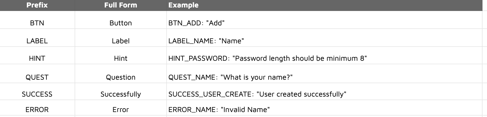

#### $\textcolor{red}{\textsf{Color didint work .}}$

#### $\textcolor{green}{\textsf{Color didint work .}}$

$${\color{green}Preview\ text}$$

$\color{#D29922}\textsf{\Large\&#x26A0;\kern{0.2cm}\normalsize Warning}$ 
$\color{#58A6FF}\textsf{\Large\&#x24D8;\kern{0.2cm}\normalsize Note}$

$foo$
$lorem ipsum dolor sit amet$

**$\text{lorem ipsum dolor sit amet}$**

**$\textbf{lorem ipsum dolor sit amet}$**

$\textbf{lorem ipsum dolor sit amet}$

$hello$
`$\fcolorbox{yellow}{red}{\textsf{lorem ipsum}}$`


# Pull Request
#### 1.  Always give a `Proper Branch Name`. Remember to include `UI` at the end of the branch name to differentiate it from `FE branch`.
### $${\textcolor{green}{\textsf{----------------------------Best Practice----------------------------}}} {\textcolor{red}{\textsf{----------------------------Bad Practice----------------------------}}}$$
```
 feature/event-creation-ui			feature/event-creation-ui-karma
 feature/profile-ui				event_creation
 feature/auth-ui				ft/event-creation

```
>
> ### $\textcolor{red}{\textsf{PR-001: Nu. 20}}$
>


&nbsp;
#### 2. Make `PR comments` easily comprehensive using these tags along with comments
-for #Mandatory and #Fine the comments have to be resolved immediately
-Reviewers have to make sure not to approve PR unless these two comment tags (#Mandatory and #Fine) are resolved.
### $${\textcolor{green}{\textsf{-------List of Tags----------------------------}}}$$
```
 #Doubt
 #Suggestion
 #Refactor
 #Mandatory
 #FutureRecommendation
 #Fine
```

&nbsp;
#### 2. While commiting, the message should be meaningful and understandable. "Commit a command, not a story or gibberish words"

### $${\textcolor{green}{\textsf{----------------------------Best Practice----------------------------}}} {\textcolor{red}{\textsf{----------------------------Bad Practice----------------------------}}}$$
```
- Never use special characters  for messages.

 	git commit -m "layout for student profile " 				git commit -m “layout!”

- Never use numbers in your message while Commiting

	git commit -m "Responsive Layout" 					git commit -m “Responsive Layout 1”
```

>
> ### $\textcolor{red}{\textsf{PR-003: Nu. 30}}$
>


&nbsp;
#### 3. Proper title and Description should be given to one's `PR review`.
- From the Title of a PR, the reviewer must get a picture of what the developer has worked on.
- A well described summary of work flow for reviewers to understand.
- Give Proper Tags for the PR.
-  `[WIP]` : If the developer is still working on it.

`Not necessary to tag people if the PR is [WIP].`
- `[NORMAL]` : If it is not required urgently.
- `[RUSH]` : If it is required atleast two days.
- `[URGENT]` : If it is required in same day. (URGENT PR should be merged in the same day if not fine)


`With [RUSH] tag, mention the deadline, and the deadline should be flexible enough for the fellow developers to review pr without intervening their work.(should not be more than two days.)`
- The tag keyword must be prefixed with Project code. e.g [CLUB RUSH]
-  Full Format: `[CLUB RUSH <DD-MM-YYYY>]`
- Example :` [CLUB RUSH 03-12-2022] PR title `


>
> ### $\textcolor{red}{\textsf{PR-004: Nu. 20}}$
>

&nbsp;
#### 4. Make sure to `Put Screenshots` of UI designs when creating a pull request for your team to review. AND add `screen recording` if there is any transition taking place.
- Put the screenshots in the respective component file.
- Put screenshots for any kind of design changes- major or minor.

>
> ### $\textcolor{red}{\textsf{PR-005: Nu. 20}}$
>


&nbsp;
#### 5.  Always `Include all the UI Team Members`, `FE,UX and PA member(project based)` for your PR review.

>
> ### $\textcolor{red}{\textsf{PR-006: Nu. 10}}$
>

&nbsp;
#### 6. Always `review PR` that you are tagged in, `before the deadline`.

>
> ### $\textcolor{red}{\textsf{PR-007: Nu. 30}}$
>

&nbsp;
#### 7. Repeating the same mistake or ignoring previous PR comments

>
> ### $\textcolor{red}{\textsf{PR-008: Nu. 30}}$
>

&nbsp;
#### 8. PR should not be too lengthy.
- Organize PR's in small chunks.

>
> ### $\textcolor{red}{\textsf{PR-009: Nu. 20}}$
>

# Formatting
#### 1. Formatting does not follow the `convention standard (HTML, SCSS, TS, JSON)`.

>
> ### $\textcolor{red}{\textsf{FORMATE-001: Nu. 20}}$
>

&nbsp;
#### 2. Maximum Lines of code for any SCSS is 500.
>
> ### $\textcolor{red}{\textsf{FORMATE-002: Nu. 20}}$
>


&nbsp;
#### 3. Always add a Revisit tag when you need to Revisit a code. It can be used in two ways:
***Note***: *Remove this tag after visiting or refactoring your code. Avoid commenting your code in the file or you MUST have a proper title description of why you have done so*.

Formats for revisit tag should be strictly in the following format:
1. REVISIT-TRANSLATE 
	 This tag is used if you need to add the translation later.
2. use TODO as revisit tag
	 Eg: TODO BE/FE : comment

>
> ### $\textcolor{red}{\textsf{FORMATE-003: Nu. 20}}$
>

 &nbsp;
#### 4. Follow a proper format for writing your html code

```html
Syntax:
<div
  *ngIf="condition" 
  *ngFor="condition"
  HTMLAttr FlexLayoutAttr
  [class, type, label, placeholder) 
  [inputData]= “inputData” 
  [outputData]=”outputData” 
  [routerLink]= “link“ 
  (click)= “function“
  data-cy="dataCy">
</div>
 																															 
<mat-select *ngIf="condition" fxLayout="row" fxFlex="100" class="custom-select" data-cy="dataCy">									 
  <mat-option value="option" *ngFor="condition">Option</mat-option>	
</mat-select> 											 																														

<sf-input *ngIf="condition"
	*ngFor="condition"
	[control]="props('min_price')" 
	[appearance]="'outline'
	[label]="'MINIMUM_PRICE'"
	[type]="'number'"
	[suffixIcon]="'close'
	(clickFunction)="removeValue($event, 'min_price')"  
	[customClass]="'full-width and-cursor'" 
	fxLayout=”row” fxLayout.lg=”column” fxLayout.md=”column-reverse”
	fxLayout.sm=”column-reverse” fxLayout.xs=”column” 
	fxFlex=”20” fxFlex.lg=”100” fxFlex.md=”100” fxFlex.sm=”100” fxFlex.xs=”100”
	fxLayoutAlign=”center center” fxLayoutAlign.lg=”center center” 
	fxLayoutAlign.md=”center center” fxLayoutAlign.sm=”center center” fxLayoutAlign.xs=”center center” 
	class=”hello-world” [class.condition]=”hello-heaven”
	[ngClass]=”{‘hello-paradise’ : condition}” ngClass.md=”hello-hell” ngClass.sm=”hello-hell” ngClass.xs=”hello-hell”
	[inputData]= “inputData”
	[outputData]=”outputData”
	[routerLink]= “link“
	(click)= “function“>
</sf-input>

project with Tailwind:

<div *ngIf="condition"
	role="button" aria-label="open the modal for filter"
	class="flex justify-center custom-btn p-12 xs:w-full sm:w-[50%] hover:bg-primary"
	(click)="function()"
	data-cy="openFilter"
	>
</div>
```

# Translation

#### 1. One should not miss any translation.
- Always add a comment whether the translation or Data is coming from BE/FE.

### $${\textcolor{green}{\textsf{----------------------Best Practice----------------------}}} {\textcolor{red}{\textsf{-----------------------Bad Practice-------------------}}}$$
```html
<span fxFlex="95" class="gray-color">                                       <span fxFlex="95" class="gray-color">
       {{'CANT_RESCHEDULE' | translate }}                                        {{'Can't Reschedule'}}
</span>                                                                     </span>																						                                                            
 // REVISIT TRANSLATE							    // Dummy Text, translation from FE
<span> Name </span>							     <span> Name </span>
```
>
> ### $\textcolor{red}{\textsf{TRANS-0013: Nu. 20}}$
>

&nbsp;
#### 2. One should have a proper name for a translation key. 
- A translation key should always be in uppercase.
- Translation keys should not be too lengthy. Avoid using conjunctions and articles in translation key.
- Do not break your sentence, instead use innerHTML
- For Safire and third party use translation as input and not as attribute.  
- Always use translation prefix depending on the type of your translation.
- Please follow the priority levels of prefix based on which you may use the prefix that you want for the desired translation key
 
		1. BTN
		2. LABEL
		3. HINT
		4. QUEST
		5. SUCCESS
		6. ERROR


- Please add full stop in your `ERROR, SUCCESS and HINT` texts only if  it is a full fledged sentence or long sentence or is a requirement from client/BA.

> **Translation Prefix to be used**
<div align="center">	
  
</div>

### $${\textcolor{green}{\textsf{----------------------Best Practice----------------------}}} {\textcolor{red}{\textsf{-----------------------Bad Practice-------------------}}}$$
 ```
 LABEL_NAME 							cant_reschedule
 BTN_ADD    							cant_reschedule_your_appointment_for_meeting
 QUEST_YOUR_NAME  						QUEST_WHAT_IS_YOUR_NAME
```
>
> ### $\textcolor{red}{\textsf{TRANS-002: Nu. 20}}$
>

&nbsp;
#### 3. For a line of long translation that expands beyond one's linting limit, include a backtick and break the line in multiple lines.

### $${\textcolor{green}{\textsf{----------------------Best Practice----------------------}}}$$
```
  "HINT_DROP_SIGNATURE": "Drop your signature here or
   <span class=\"text-primary\"><u class=\"font-bold\">Choose File</u></span>",
```

### $${\textcolor{red}{\textsf{----------------------Bad Practice----------------------}}}$$
```
  "HINT_DROP_SIGNATURE": "'Drop your signature here or' +
   <span class=\"text-primary\"><u class=\"font-bold\">Choose File</u></span>",
```
>
> ### $\textcolor{red}{\textsf{TRANS-003: Nu. 30}}$
>

&nbsp;
#### 4. Proper use of params
- Don't use params when it is at the beginning or end of the sentence.
- param name should be proper.

### $${\textcolor{green}{\textsf{----------------------Best Practice----------------------}}} {\textcolor{red}{\textsf{-----------------------Bad Practice-------------------}}}$$
```
**en.ts**
'SCHEDULED_RETAILER': 'Scheduled Interaction with Retailer' 		'SCHEDULED_RETAILER': 'Scheduled Interaction with Retailer {{value}}'

 **HTML**
 {{'SCHEDULE_RETAILER' | translate}} {{count}}  			{{'SCHEDULE_RETAILER' | translate : { value: 12 } }}
```

&nbsp;
#### 5. Segregate backend translations in a `folder` or as a separate `file`

### $${\textcolor{green}{\textsf{----------------------Best Practice----------------------}}}$$
```
				**Folder**
				 Backend
				  en.json
				  de.json
				**File**
				 backend_en.json
				 backend_de.json
```

&nbsp;
#### 6. Do not use abbreviation in translation keys
- The only abbrev allowed is ID or product short keys like NNI.
### $${\textcolor{green}{\textsf{----------------------Best Practice----------------------}}} {\textcolor{red}{\textsf{-----------------------Bad Practice-------------------}}}$$

```
"LABEL_BASIC_INFORMATION": 					"Basic Information","LABEL_BASIC_INFO": "Basic Information",
"LABEL_PHONE_NUMBER": "Phone No."				"LABEL_PHONE_NO": "Phone No."
```

&nbsp;
#### 7. Avoid adding translations for static text.
- ### $${\textcolor{red}{\textsf{----------------------Bead Practice----------------------}}}
```
						**Examples**:
						LABEL_ID
						LABEL_SL
						LABEL_SELISE
						LABEL_HQ etc
```

# Presentation

#### 1. Every two weeks (usually on wednesday) a peer programming team (of two) has to do a presentation on a topic they can select. Teams should be aware of their turn and present on that day accordingly.
>
> ### $\textcolor{red}{\textsf{PPT-01: Nu. 20}}$
>

&nbsp;
 # BEM (Block__Element--Modifier)
 #### The Block, Element, Modifier methodology (commonly referred to as BEM) is a popular naming convention for classes in HTML and CSS. It’s a CSS naming convention for writing cleaner and more readable CSS classes. BEM also aims to write independent CSS blocks in order to reuse them later in your project.

A **BEM** class name includes three parts. 
    1.**Block** - Standalone component that is meaningful on its own.
    2.**Element** - Part of a block that has no standalone meaning.
    3.**Modifier** -  Either a block or element may have a variation signified by a modifier &nbsp; &nbsp;

**BEM class namings**
```css
//Blocks are named as standard CSS classes
.block {
}

//Elements declared with 2 underscores, after block
.block__element {
}

//Modifiers declared with 2 dashes, after block or after element
.block--modifier {
}

//element and modifier together
.block__element--modifier {
}
```

&nbsp;
### 1.Wrongly nested blocks and elements
- It is not allowed to nest blocks. If you start a new block, you are not allowed to proceed with elements from another block.
### $${\textcolor{green}{\textsf{----------------------Best Practice----------------------}}} {\textcolor{red}{\textsf{-----------------------Bad Practice-------------------}}}$$
```html
Bad Practice Best Practice
<div class="card">						<div class="card">
 <div class="card__header"> 					 <div class="header">
    <h2 class="card__headline></h2>				  <h2 class="card__headline></h2>
  </div>							</div>
</div>								</div>
```
>
> ### $\textcolor{red}{\textsf{BEM-01: Nu. 20}}$
>

&nbsp;
### 2. Great-grandchildren
- There are no grandchildren nor great-grandchildren in BEM. Instead, »normal« elements of the block can be used.
### $${\textcolor{green}{\textsf{----------------------Best Practice----------------------}}} {\textcolor{red}{\textsf{-----------------------Bad Practice-------------------}}}$$
```html
<div class="card">						<div class="card">
  <div class="card__header">					 <div class="card__header">
    </h2><h2 class="card__headline></h2>			  <h2 class="card__header__headline>
  </div>							 </div>
</div>								</div>
```
>
> ### $\textcolor{red}{\textsf{BEM-02: Nu. 15}}$
>

&nbsp;
### 3. Modifiers without a base class
- Modifiers cannot exist without a base block or element.
### $${\textcolor{green}{\textsf{----------------------Best Practice----------------------}}} {\textcolor{red}{\textsf{-----------------------Bad Practice-------------------}}}$$
```html
<div class="card card--highlight">				<div class="card--highlight">
  <div class="card__header"></div>			 	 <div class="card__header"></div> 
</div>								</div>

<div class="card">						<div class="card">
 <div class="card__header card__header--important"></div>	 <div class="card__header--important">
</div>								</div>
```
>
> ### $\textcolor{red}{\textsf{BEM-03: Nu. 10}}$
>

&nbsp;
### 4. Too big blocks
- It is not a good idea to create really big blocks. The idea of BEM is to create modular and reusable blocks.
### $${\textcolor{green}{\textsf{----------------------Best Practice----------------------}}} {\textcolor{red}{\textsf{-----------------------Bad Practice-------------------}}}$$
```html
<body class="body">					<body class="body">
    <header class="header">				 </header><header class="body__header"></header>
     <main class="main"></main>				  <main class="body__main"></main>
    <footer class="footer"></footer>			 <footer class="body__footer"></footer>
</body>							</body>
  ```

 &nbsp;
 # Utilities and Suggestions
 ## BEM: button__label--active and button--disabled

- Following are the listed common Utilities we used in the project:
```html
1. Text-align : (text--center, text--left, text--justify and text--right)

2. Cursor : (cursor--pointer, cursor--move, zoom-out, not-allowed and etc)

3. Width : (width--full , width--half)

4. Color : (color--primary, color--secondary, color--black-80 and etc..)

5. Background color : (bg--primary, bg--black-light, and etc..)

6. Font style : (font--normal, font--italic and font--oblique)

7. Font weight : (font--bold, font--lighter and font--normal) 

8. Text-transform : (text--lowercase, text--uppercase and text--capitalize)

9. Display : (display--none, display--inline, display--flex and so on)

10. Position : (position--static, position--absolute, position--fixed and position--sticky)

11. Unset : (unset--all)

12. Border : (border--primary, border--secondary and etc...)

13. Text-decoration : (text--no-decoration, text--overline, text--underline and etc...)

14. Vertical align : (ver--top, ver--baseline, ver--bottom and etc...)

15. White-space : (white-space--nowrap, white-space--pre-wrap, white-space--pre)

16. Float : (float--left and float--right)

17. List-style : (list-style--none)


```
&nbsp;

- For numbers where we use utilities like `margin`,`padding`, `border-radius`,`font-size`,`line-height` and etc

```html
m-2, p-2, fs-12, br-4, mnx-16, lh-16  and etc
```

- Exceptions from mixin
```html
text--truncate,width--full, center--block and etc...
```

# References

1. **CSS Formatting Guidelines**: https://www.drupal.org/docs/develop/standards/css/css-formatting-guidelines
2. **SASS Documentations**: https://sass-lang.com/documentation
3. **SCSS Linting**: https://github.com/brigade/scss-lint
4. **HTML Documentation**: https://devdocs.io/html/
5. **SCSS/SASS/HTML online compiler**: https://www.sassmeister.com/
6. **CSS Guidelines**: https://cssguidelin.es/ 
