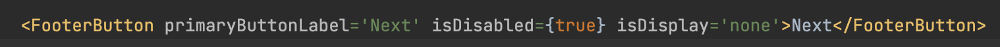

<div align="center">
	<br>	
		
	<br>
</div>


# Directories & Files Naming
As usual we will have a ‘***stylesheets***’ directory for all the stylesheets file named as following:

**File name & context**

* ***mixins.scss*** :  Make a directory and include all of the one block mixins for vertical-align, text-transform, box-shadow, transition, cross-browser filter and etc here.
* ***padding.scss :*** Partial for padding helper classes mixins only
* ***margin.scss***: Partial for margin helper classes mixins only
* ***typography.scss***: Partial for font size helper classes mixins only
* ***fonts.scss***: Partial for font family helper classes mixins only if we use copyright fonts. Use CDN for free fonts
* ***variables.scss***: Partial containing all the variables for colors or anything to avoid redundancy
* ***utility.scss***: Partials for common utility classes 
* ***grid.scss***: Partial for custom grid classes if we are to use our own grid system other than bootstrap or flex
* ***common.scss***: Partials for common classes used in multiple components
* ***overwrite.scss***: Partials for overwriting classes
* ***sf-config.scss***: Configure all the safire imports here


> <span style="color:#FF0000">If incase the filename is different than its purpose</span>
>
> ### UI-001: Nu.30
>

# CSS

#### 1. Class Naming Convention
* `Always use class instead of ID. `
* Use easily comprehensive classes.
* should only use hyphen`(-)` and `(_)`.
* Avoid using numbers in class names.
* Class names should all be in lowercase only and should be meaningful.
* Do not use lengthy names (do not exceed more than three words unless you don’t have a choice).
* Avoid using HTML elements as a selector or class if not for generic styling.
* You may use abbreviations for class names. `Eg: img for image, btn for button.`but do not use stupid short forms like grp for group, ctn-table.
* Always define a class with the module name and component we are working on.
`Eg: Suppose I am working on ACTIVITY LOG. Define class as .activity-log for main wrapper and followed by which section we want to apply styling.`

&nbsp;

 
 ```
✅ Best Practice:

 .user-table
 .profile__card
 .profile__card--background
 .action-btn
 .default-btn
 .radio-group
 .img-container,img-thumbnail 
```

```
❌ Bad Practice:

 .userTable
 .table1
 .image-action-for-list-button 
 .grp-container
```
> <span style="color:#FF0000">In case of weird names</span>
>
> ### CSS-001: Nu. 30
> 


&nbsp;
#### 2. Always prioritise on using predefined utility class which is either provided by mixins or common styles
	
``` Scss
✅ Best Practice:                       			❌ Bad Practice:

Scss: 										
.font-size-12 {	   						.world-text {									
  font-size: 12px; 						  font-size: 12px;	 		  
}								 }

```
```html
HTML:
<p class=”font-size-12”>Hello</p> 				<p class=”font-size-12”>Hello</p>
<p class=”font-size-12”>World</p> 				<p class=”world-text”>World</p>
```

> <span style="color:#FF0000">Using explicit scss or css even when there are utility classes will cause you the fine below</span>
>
> ### CSS-002: Nu. 20
>

&nbsp;
#### 3. For `padding, margin and font-size`, let’s follow` multiples of 4 or 2 `and as far as possible, avoid using negative margin.


```scss
        ✅ Best Practice:               			      ❌ Bad Practice:

		h1 {							h1 {
		 font-size: 24px: 	 				font-size: 35px;
		} 							}
		h2 {							h2 {
		 font-size: 20px;	 				 font-size: 23px:
		}							}
		.p-4 {							.p-5 {
		 padding: 4px;						 padding: 5px;
		}							}
		.p-8 {							.p-9 {
		 padding: 8px;						 padding: 6px;
		}							}
		.m-4 {							.m-7 {
		 margin: 4px;						 margin: 7px;
		}							}
		.m-8 {							.m-8 {
	 	 margin: 8px;							 margin: 9px;
		}							}
```

> <span style="color:#FF0000">There will be certain exceptions but given that positive or multiples of 2 or 4 could have been used, you will be fined</span> 
>
> ### CSS-003: Nu. 20
>


&nbsp;
#### 4. Avoid giving inline css to an html tag. Instead give a proper css class

```scss
✅ Best Practice:					        ❌ Bad Practice:

Scss:
 .my-element {
  color: blue;
  font-size: 16px;
  /* Other styles... */
}
```
```html
Html:
 <div class=”my-element”></div> 				<div style="color: blue; font-size: 16px;">
									Content here</div>
```

> <span style="color:#FF0000">There will be certain exceptions but given that inline could have been avoided, you will be fined.</span>
>
> ### CSS-004: Nu. 20
>

&nbsp;
#### 5. Make best use of shorthand property
Refer: https://developer.mozilla.org/en-US/docs/Web/CSS/Shorthand_properties

Generator: https://shrthnd.volume7.io/

```scss
✅ Best Practice:								❌ Bad Practice:

p {  										  p {
 margin: 4px;									    margin-left: 4px;
 background: #000 url(‘images/bg.gif’) no-repeat left top;			    margin-right: 4px;
}										    margin-top: 4px;
.info {										    margin-bottom: 4px;
 margin: 4px 8px;								    background-color: #000;
}										    background-image: url(‘images/bg.gif’);
.card-layout {								            background-repeat: no-repeat;
 margin: 16px 4px 8px;								    background-position: left top;
}										  }
										  .info {
										    margin-left: 4px;
										    margin-right: 4px;
										    margin-top: 8px;
										    margin-bottom: 8px;
										  }
										  .card-layout {
										    margin-left: 4px;
										    margin-right: 4px;
										    margin-top: 16px;
										    margin-bottom: 8px;
										  }
```

>
> ### CSS-005: Nu. 20
>


 &nbsp;

#### 6. Use specific property for background unless all properties are covered in the shorthand property.
-for background image use background-image.

-for background color use background-color.

```scss
✅ Best Practice:								❌ Bad Practice:

.example {  									.example { 
 background-color:red;								 background:red;
}			    							}
										    
.image-example {								.image-example {
 background-image: url('path/to/image.jpg');					 background: url('path/to/image.jpg');
}										}
 								   
```

 &nbsp;
#### 7.For helper classes let’s not use `!important` because it should be overwrite-able

```scss
✅ Best Practice:								❌ Bad Practice:

body {  									body { 
 font-family: Arial;								 font-family: Aria !important;
 overflow-x: hidden;	    							 overflow-x: hidden !important;
 font-size: 14px;								 font-size: 14px !important;
}										}

 h1 {										h1 {
 font-size: 28px;								 font-size: 28px !important;
}								   		}
```

> <span style="color:#FF0000">There will be certain exceptions but given that this could have been avoided, you will be fined</span> 
>
> ### CSS-006: Nu. 20
>


&nbsp;
#### 8. Always look for an alternative other than using `position:absolute/fixed`. It’s convenient to use that but it would cause issues that we never imagined(must have clear understanding and should be in position to explain you the individal have used).

```scss
✅ Best Practice:								❌ Bad Practice:

***Use flex or float for alignment***
 Example:
   float: right; 								 .profile-img {
   align-self: auto | flex-start | flex-end | center | baseline | stretch;	   position: absolute;
										   right: 0 !important;
										  }
```

> <span style="color:#FF0000">There will be certain exceptions but given that this could have been avoided, you will be fined</span>
>
> ### CSS-007: Nu. 50
>

&nbsp;
#### 9. Use `Single Quote` for all urls and contents (Refer Onboarding steps)

```scss
✅ Best Practice:						❌ Bad Practice:

.container { 							.container {
  background-image: url('images/logo.png');  			 background-image: url("images/logo.png");
 } 								}								 
```
>
> ### CSS-008: Nu. 100
>

&nbsp;
#### 10. Make best use of `cal()` function along with vh and vw instead of static pixels. 
Refer: https://www.sitepoint.com/css-viewport-units-quick-start/

$\color{#58A6FF}\textsf{\large\&#x24D8;\kern{0.15cm}\normalsize &nbsp;Note: You might need to cosider using dvh | dvw for resposiveness}$

```scss
✅ Best Practice:						❌ Bad Practice:

.plot { 							.plot {
   width: calc(100vw - 100px);  			 	 width: 1000px;
   height: 100dvh;						 height: 900px;
} 								}

								 @media (min-width: 600px) {
								   .plot {
								    width: 600px;
								    height: 700;
								  }
								  @media (max-width: 599px) {
								   .plot {
								    width: 500px;
								    height: 600px;
								  }							 
```

&nbsp;
#### 11. Use `Clearfix` to avoid HTML element jam
Refer: https://css-tricks.com/clearfix-a-lesson-in-web-development-evolution/

add eg

&nbsp;
#### 12. Border radius should be uniform components with edges like buttons and cards according to style guidelines.

```scss
✅ Best Practice:						❌ Bad Practice:

button, .card { 						button {
   width: calc(100vw - 100px);  			 	 border-radius: 10px;
   height: 100dvh;						 height: 900px;
} 								}

								.card {
								   border-radius: 4px;
								}							 
```


# HTML
#### 1. HTML Hierarchy
Refer: https://medium.com/ux-art/html-hierarchy-tree-7a2947f2bf01

- Let’s avoid declaring `<p>` inside any `<button>` and using block element inside inline element etc


```html		
✅ Best Practice:								❌ Bad Practice:
	
1. <button mat-button color="primary>						1. <button mat-button color= "primary">
	  Login						  			    <p>Login</p>
   </button>  									   </button>   

2. <p>   									2. <p> 
	Hello									     Hello
    <span>World</span>								     <div>World</div>
   </p>                                       					</p>
```

> <span style="color:#FF0000">By any means we have to follow HTML hierarchy</span>
>
> ### HTML-001: Nu. 20
>

&nbsp;
#### 2. Always give alt attribute with an `` tag
- Please use a parent element to define the height for the image(for responsive)
- Use underscore (_) for naming images.
- Please add proper descriptive text with proper sentence formatting.

```html				
✅ Best Practice:							❌ Bad Practice:
						

alt=”Profile Image” class="width-full" />				
																			
```
> <span style="color:#FF0000">All images should have alt attribute with proper text which is not repetitive</span>
>
> ### HTML-002: Nu. 10
>


&nbsp;
#### 3. Always compress file size of assets to not hamper load time
*Recommendation for image resize files:* 
1. Figma
2. Photoshop
		
		
> <span style="color:#FF0000">If image is not compressed and still in KB</span>
>
> ### HTML-003: Nu. 20
>
> <span style="color:#FF0000">If Image is in MB</span>
>
> ### HTML-004: Nu. 50
>

&nbsp;
#### 4. Same design needed in multiple placeholder
- If the same design is required in multiple placeholders, let’s create directive or a component template for it, so that we can maintain clean codes as well as it will be convenient to modify in future.

> <span style="color:#FF0000">There will be certain exceptions but given that this could have been avoided, you will be fined</span>
>
> ### HTML-005: Nu. 20
>


&nbsp;
#### 5. Loop Over the classes or elements that have the same properties.

```html
✅ Best Practice:								❌ Bad Practice:
													            
    <mat-card *ngFor="let item of items">{{item}} </mat-card> 			<mat-card> </mat-card>
							  			<mat-card> </mat-card>
										<mat-card> </mat-card>
										<mat-card> </mat-card>
```
>
> ### HTML-006: Nu. 20
>


&nbsp;
#### 6. Use of HTML entity
- Use html entity for cases like copyright instead of special characters.

```html
✅ Best Practice:						❌ Bad Practice:

 `&copy` copyright, All rights reserved.			***Do not copy paste and use***	
								© copyright, All rights reserved.
```
 
- Bind currentYear in FE and BE both

```
✅ Best Practice:								❌ Bad Practice:
  ***Angular***
   ts: year = new Date().getFullYear();						Company Name 2020, All rights reserved
   HTML: Company Name {{year}}, All rights reserved. 
  ***Rails***
   Company Name <%= DateTime.now.year %>, All rights reserved.
```
>
> ### HTML-007: Nu. 20
>

&nbsp;
#### 7.Carelessness

```html     
✅ Best Practice:       						❌ Bad Practice:
                			 
<p> Hello </p>								 <P> Hello </P>
<div> Lorem Ipsum </div>						 <DIV> Lorem Ipsum </div>
```

>
> ### HTML-008: Nu.50
>

&nbsp;
#### 8. HTML Lines  of code
- html lines of code should not be more than (yet to discuss)


&nbsp;
#### 9. Proper Indentation of code. Use predefined HTML selectors for better segregation and understandability with proper indentation

```html
✅ Best Practice:						❌ Bad Practice:

<body>								<body>
  <div class="app-header"> 					 <header class="header">
    <h1 class="app-title">Welcome to My Web Page</h1>		 <span class="app-title">Welcome to My Web Page</span>
    <nav class="main-navigation"> 				 <nav class="main-navigation">
      <ul>								<div>
        <li><a href="#">Home</a></li>  					<div><a href="#">Home</a></div>
        <li><a href="#">About</a></li> 					 <div><a href="#">About</a></div>
        <li><a href="#">Services</a></li>				 <div><a href="#">Services</a></div>
        <li><a href="#">Contact</a>					</div> <li><a href="#">Contact</a></div>
      </ul> 								</div>
    </nav>  								</div>
  </header>  							</header>

  <main class="main-content"> 					  <div class="main">
    <section class="main-content__preview">				<div class="main-content1">
      <h2>About Me</h2>							 <div>About Me</div>
      <p>Lorem ipsu fringilla malesuada faucibus.</p> 				 <p>Lorem ipsu fringilla malesuada faucibus.</p>
    </section>								</div>

    <section class="main-content__preview">  					 <div class="main-content2">
      <h2>Services</h2>								 <span>Services</span>
      <ul>										 <p>
        <li>Web Design</li>								<p>Web Design</>
        <li>Graphic Design</li>								 <p>Graphic Design</p>
        <li>SEO Optimization</li>							<p>SEO Optimization</p>
      </ul>											 </p>
    </section>											</p>
  </main>											</p>
				
  <footer class="app-footer">								 <div class="footer">
    <p>&copy; 2023 My Web Page. All rights reserved.</p>				 <p>&copy; 2023 My Web Page. All rights reserved.</p>
  </footer>											 </footer>
</body>												</body>
										
```

&nbsp;
#### 10. We need to start using html5 tags since these help us in understandability. It also helps in SEO.

```html
✅ Best Practice:

<html>
<body>
 <header></header>
 <aside></aside>
 <section>
     <article></article>
 </section>
  <section></section>
  <footer></footer>
</body>
</html>
 ```

&nbsp;
#### 11.If there are more than one images, let's group them inside the `<figure>` tag.

```html
✅ Best Practice:									❌ Bad Practice:
					
<figure>									 		
 			  
 		 	  
 			  
</figure>																													  	
```

&nbsp;
#### 12. Use of Default Images
Storing dummy images locally are not allowed, instead use default images. If using cdn links for images, then generate the link from Assets Manager. <a href="https://selise.assets.selise.club/" target="_blank">Click here</a> to generating the link

> <span style="color:#FF0000">If found storing dummy images</span>
>
> ### HTML-009: Nu. 30
>

&nbsp;
# SCSS

#### 1. Stylesheet filename should always use `hyphen` between 2 words. Use max 2 words only. Avoid obvious terms like styles

$\color{#58A6FF}\textsf{\large\&#x24D8;\kern{0.2cm}\normalsize Note:}$ Start using @use and @extend

```
✅ Best Practice:					❌ Bad Practice:

 _fonts.scss						1.Including all the styles in style.scss.
 _utility.scss 						2.File named as font-size.scss or media-query-mixin.scss
 _font-size.scss
 _overwrite.scss
 All the above compiled in style.scss

```

> <span style="color:#FF0000">Basic SCSS</span>
>
> ### SCSS-001: Nu. 30
>


&nbsp;
#### 2. Define Variables for colors always 
- Try to use material template color variables if using material UI.
- Always use 6 digit/character's HEX value in CAPITAL letters.
- Always use 3 DIGIT decimal value for alpha in rgba value.
- Don't give shitty name for the variable.  


```scss
✅ Best Practice:					❌ Bad Practice:

 *Variable*						*Including all the styles in style.scss*
 $black: #000000;					p {
 p {							  color:  #000;
  &nbsp;&nbsp;color: $black;				}
 }							.info-text {
 .info-text {						 color: #000000;
  &nbsp;&nbsp;color: $black;				}
 }							.black-7 {
 .black-70 {						 color: rgba( $black, 0.7 );
  &nbsp;&nbsp;color: rgba( $black, 0.70 );		}
 }

*Naming a color :
greyish-pink: '#C48D8A'					'peach-fog': '#C48D8A'; (Since a peach will change its color throughout its
										lifespan.)			
procelain-blue: '#ECF2F8',				'squeeze-blue': '#ECF2F8',(please don't squeeze any color),
pinkish-red: '#FBF0F3',					'amour-pink': '#FBF0F3',(Can you imagine how it will look when a warrior goes to war with pink armor?)
```

> <span style="color:#FF0000">DO NOT use the hex value or color name directly in your scss..</span>
> ### CSS-002: Nu. 30
>
> 
> <span style="color:#FF0000">Do not name a color as you wish; variables should have a meaningful or understandable name..</span>
>
> ### CSS-002.1: Nu. 10
>

&nbsp;
#### 3. Do not define variables for rgba colors. Use sass functionality instead

* No more having multiple shades of gray each time a new color is given in our specs.We only use the existing colors we have defined (We can discuss and add up the colors which we have used most commonly all over our projects).

```scss
✅ Best Practice:						❌ Bad Practice:

 *Variable*
 `$black: #000000;`						$black-87: rgba(0,0,0,0, 0.87);
								$black-90: rgba(0,0,0,0, 0.90);
 p {
  color:  rgba($black, 0.70);
 }
```

> <span style="color:#FF0000">Unnecessary shades of any colors will be fined.(exceptional: primeNG theming)</span>
>
> ### SCSS-003: Nu. 20
>


&nbsp;
#### 4. Media queries should be within the same class instead of separate general device queries.

```scss
✅ Best Practice:					❌ Bad Practice:

 .header {						.header {
   width: 1000px;					  width: 1000px;
    @media (max-width: 350px) {				}
      width: 120px;					 @media (max-width: 350px) {
    }							    .header {
    @media (max-width: 980px) {					width: 120px;
	width: 320px;					    }
   	}
      }							 @media (max-width: 980px) {
    }							  .header {
							       width: 320px;
							      }
							  }

> <span style="color:#FF0000">For better readability it's always better to include all the media queries wrapped within the particular element or class.</span>
>
> ### SCSS-004: Nu. 40
>


&nbsp;
#### 5. If same styling is to be applied in multiple classes then use `sass @extend`

```scss
✅ Best Practice:					❌ Bad Practice:
Example 1 (@extend with placeholder selector)

 %button-basic  {					.button-report  {
  padding: 12px 20px;					 padding: 12px 20px;
  text-align: center;					 text-align: center;
  font-size: 16px;					 font-size: 16px;
  text-transform: uppercase;				 text-transform: uppercase;
  cursor: pointer;					 background-color: red;
}							}
 .button-report  {					.button-submit  {
  @extend %button-basic;				 padding: 12px 20px;
  background-color: red;				 text-align: center;
}							 font-size: 16px;
.button-submit  {					 text-transform: uppercase;
  @extend %button-basic;				 cursor: pointer;
  background-color: green;				 background-color: green;	
  color: white;						 color: white;
}							}

Example 2 (@extend with class selector)
 .button-basic  {
  padding: 12px 20px;
  text-align: center;
  font-size: 16px;
  text-transform: uppercase;
  cursor: pointer;
}
 .button-report  {
  @extend .button-basic;
  background-color: red;
}
.button-submit  {
  @extend .button-basic;
  background-color: green;
  color: white;
}
```

> <span style="color:#FF0000">Repetition will be fined</span>
>
> ### SCSS-005: Nu. 20
>

&nbsp;
#### 6. Basic CSS/SCSS typos or combinations missed


```scss
✅ Best Practice:				❌ Bad Practice:

 .container, .profile { 			.container {
    width: 100%;				 width: 100%;
 }						}
						.profile {
						  width: 100%;
						 }
```
>
> ### SCSS-006: Nu. 50
>


&nbsp;
#### 7. Copied Codes not removed

```html      
✅ Best Practice:						❌ Bad Practice:
                     				
<table mat-table>   				    		<table mat-table>													 <th mat-header-cell> Weight </th>			 <th mat-header-cell> Weight </th> 											 <td mat-cell> {{element.weight}} </td>			   <!--Name Column--> 											</table>							   <!--Note that these columns can be defined in any order. -->	 		 
								  <td mat-cell> {{element.weight}} </td>	     														  		 <td mat-cell> {{element.weight}} </td>	
								<table>  
```

>
> ### SCSS-007: Nu.30
>

&nbsp;
#### 8. Provide the stylesheet info by commenting
- recommended for mixins

```scss
✅ Best Practice:

_variables.scss
/*
Variables.scss: contains variables referable by other stylesheet to avoid redundancy 
*/
```

&nbsp;
#### 9.Always write (&:hover, &:focus) intact and give pointer cursor to all action links and buttons

```css
✅ Best Practice:

a {
   text-decoration: none;
   &:hover, &:focus {
   cursor: pointer
  }
}
```

&nbsp;
#### 10. Let us avoid using long path names while importing

```scss
✅ Best Practice:								❌ Bad Practice:

 @import ‘variables’; 								@import ‘../../assets/stylesheets/variables’
 @use ‘variables’ as *; 
 

Add "stylePreprocessorOptions" in angular.json

example of config: 
"architect": {
        "build": {
          "options": {
            "stylePreprocessorOptions": {
              "includePaths": ["apps/your-app/src/assets/styles"]
            },
```
&nbsp;
#### 11. Always install SCSS lint plugin in webstorm or any other IDE you are using
-To be discussed further


# Framework 
## React 

### 1. File Naming Conventions
* A folder and sub folder names should always start with small letters and the function name should always be in the PascalCase (i.e, First letter of the component name with capital letter).
* Name of the folder and sub folder name  should be always separated by  “-”. 
* Avoid using “_” and avoid direct naming the folder and sub folder with “PascalCase”.

<div align="center">✅ Best Practice:</div>

<div align="center">	
  
</div>
 
&nbsp;
### 2. Structuring Folder

* All the components, globals, shared components,  assets, translation,  redux etc.. Should be written inside the app folder
* Insert all the assets inside the assets folder which included images, logo, font-family and icons .ttf/.otf files.
* Used “_” to name the assets except for the font-family and icon .ttf /.otf file as it is when we download it.
* The localization file is directly written in the app folder.

&nbsp;
### 3. Putting imports in an order
1. React import
2. Library imports (Alphabetical order)
3. Absolute imports from the project (Alphabetical order)
4. Relative imports (Alphabetical order)
5. Import * as
6. Import ‘./<some file>.<some extension>

&nbsp;
### 4. Follow the camelCase for the following:
* For the class, variable, function, styling className and etc should be always in camelCase. Avoid using the “_”, “-” or special characters and numbers.

&nbsp;
### 5. Wrapping of the 3rd party libraries in the main component/ top level component.
* To avoid the wrapping of the 3rd party libraries repeated. Please wrap it on the top level components like main.tsx or app.tsx.
  
<div align="center">✅ Best Practice:</div>

<div align="center">	
  
</div>

&nbsp;
### 6. Don’t repeat yourself [DRY]
* One of the basic principles of software development is Don’t Repeat Yourself. We must not write the same piece of code twice. Whenever you write the same piece of code twice, you must try to refactor it into something reusable, even if not completely.
* You can create your own reusable components. 

&nbsp;
### 7.Avoid inline styling
* Try to avoid inline styling as much as possible to have clean code.
* Have the styling files separate.
* Class name should be always in camelCase either you use styled-components or react native styling.

&nbsp;
### 8. Make Sure Your App is Responsive

* You must always make sure that the app you are building is responsive, meaning it is consistent across different devices and platforms.

&nbsp;
### 9.Don’t put logs
* Remove the console log before you push your changes into the release build.

&nbsp;
### 10.CSS unit accept in react-native
* React Native accept are “px” and “%” css units only, avoid using other css units in react native.

&nbsp;
### 11.Implementing styling logically
* When there are two css or more properties to implement logically in the same tag, try to have the style classname and implement it.
* Accepted for the single css property to implement logically in the tag.

&nbsp;
### 12. Line of code for the component should not exceed more than 100. 
* A file should not have more than 100 lines of code.

&nbsp;
### 13. For looping data, make a constant folder and loop data using map function.
* When similar data is repeating, please make a constant folder and loop the data using function such as map.

<div align="center">✅ Best Practice:</div>

<div align="center">	
  
</div>

&nbsp;
### 14. For theming, all the variables should be defined in ts. Then we will create a global variable in the assets folder.

<div align="center">✅ Best Practice:</div>
<div align="center">	
  
  
</div>
  
&nbsp;
### 15. Import of the required library should be particular to a file.

<div align="center">✅ Best Practice:</div>
– Use Code reformat
			OR
– github lint

  
&nbsp;
### 16. For any logical condition use hook, and interface to pass variable from on component to child component.
* Whenever there is a logical condition, use react hook such as useState, and to pass variables from parent to a child component, use props.

    i) Using use state to show and hide the elements.
  
<div align="center">✅ Best Practice:</div>

<div align="center">	
  
 <br>
  
</div>

   ii) Using props and interface to pass data from parent to child.
   
<div align="center">✅ Best Practice:</div>
 <div align="center">	
  
 <br>
  
 <br>
   
</div>
 
&nbsp;
### 17. Don’t use {} in className and props unless there are some logical conditions to be written. Value string, don’t use {} (refactor)
Avoid using {} in className unless there are some logical conditions to be written as it makes the code noisy.

✅ Best Practice:

 insert img

  
<div align="center">✅ Best Practice:</div>
 <div align="center">	
  
</div>

&nbsp;
### 18. React Material 
1. Avoid usage of p, span and div tag. We will use typography, and box layout.
React Material has their own component, that can be modified and used easily in the material configuration (theming)

<div align="center">✅ Best Practice:</div>
<div align="center">	
  
</div>
  
2. We will use mixins that is already provided by Material.
Material provide their own mixin and hence, we don’t have to create our own mixin using  SCSS.

&nbsp; 
### 19. Style Components.

1. Styled Components should be reusable by passing props.
  
Styled Components should be coded in such a way that we can pass probs. This way the styled component can be reused and line of code reduces.

<div align="center">✅ Best Practice:</div>
<div align="center">	
  
</div>
  
2. Component naming should be in Pascal Case. (Prefix should start using Styled)
  
Styled component naming convention should be in Pascal case and should start with ‘Styled’ followed by the component name. This way we can differentiate between normal components and styled component.

<div align="center">✅ Best Practice:</div>
<div align="center">	
  
</div>

3. Common style should in shared.styles.tsx
   
<div align="center">✅ Best Practice:</div>
<div align="center">	
  
</div>
 
4. UI kits needs to be wrapped by Styled Component (Optional)
  
Kits such as buttons need to be wrapped inside a styled component so that we can pass props to it or easily apply style inside the kits itself.

<div align="center">✅ Best Practice:</div>:
<div align="center">	
  
</div>


&nbsp;
# Tailwind
### 1. Make css files
Make a separate file for variable if there are many color variables only, otherwise it can be imported in config file.

```
✅ Best Practice:

 |-application.scss (just imports of files)
	|-component (Classes of only the components of a particular project)
	|-base.scss (tailwind base that you want to change)
	|-variable.scss
	|-form.scss
	|-modal.scss
	|-animations.scss
	|-overwrite.scss
	|-common.scss
```

> <span style="color:#FF0000">If in case separate files are not maintained</span>
> 
> ### tw-001: Nu.10
>


### 2. Configuration 
Same tailwind configuration to be maintained in all the projects. Make use of JIT.
  
### 3. Make best use of directive in css/scss to make components so as to avoid repetition of long  classes in html.
Ex: @apply, @layer, @variants, etc
Make best use of @apply to make common components such as btn, btn--primary, cards, etc.
More than 6 tailwind class and use case more than two then this to be included in tailwind css component with @apply


```scss
✅ Best Practice:

 @layer components { 
    .sk-btn {
      @apply h-[40px] rounded-[4px] border cursor-pointer;
        &--primary {
          @apply bg-primary text-white;
        }
        &--secondary {
         @apply bg-blue text-white;
        }
      }
```

> <span style="color:#FF0000">If in case separate files are not maintained</span>
> 
> ### tw-002: Nu.15
>


### 4. Tailwind classes
Make best use of tailwind classes instead of using css porterty

### 5. Let’s not extend colors
Instead of using tailwind colors along with project specific colors, let us only use custom colors. I.e instead of extending colors, specify it outside. 

> <span style="color:#FF0000">If in case extending colors</span>
> 
> ### tw-003: Nu.20
>

### 6. Root variable - naming convention
Always use colors as variables and variable naming of colors should be similar to the UI convention.
Ex:
primary: 46 204 113; (rgb code can be used so as to generate lighter version)
white: #FFFFFF
black: #000000
  
Not allowed to use bg-[rgba(0,0,0,0.5)], instead derive lighter version of colors from one base color. Exception for some common class.

```scss
✅ Best Practice:

 	colors: {
         withOpacityValue('--primary'),
         withOpacityValue('--success'),
         blue: withOpacityValue('--blue'),
         error: withOpacityValue('--error'),
         brown: withOpacityValue('--brown')
 	}
```
  
> <span style="color:#FF0000">if found using bg-[rgba(0,0,0,0.5)] to generate lighter color</span>
> 
> ### tw-005: Nu.15
>


### 7. PX and REM are not to be mixed
Px and Rem units are not to be mixed. All the clases with rem in tailwind should be converted to px. Ex. rounded to rounded-[4px].

> <span style="color:#FF0000">If in case found mixing above mentioned clasess</span>
> 
> ### tw-004: Nu.20
>


### 8. Gap to be used only with Grid
Gap classes to be used only with grid as there is issue with browser compatibility.

> <span style="color:#FF0000">If in case found using it with flex or others</span>
> 
> ### tw-006: Nu.200
>

# Pull Request
#### 1.  Always give a `Proper Branch Name`. Remember to include `UI` at the end of the branch name to differentiate it from `FE branch`.

```
✅ Best Practice:				❌ Bad Practice:

 feature/event-creation-ui			feature/event-creation-ui-karma
 feature/profile-ui				event_creation
 feature/auth-ui				ft/event-creation

```
>
> ### PR-001: Nu. 20
>


&nbsp;
#### 2. Make `PR comments` easily comprehensive using these tags along with comments
-for #Mandatory and #Fine the comments have to be resolved immediately
-Reviewers have to make sure not to approve PR unless these two comment tags (#Mandatory and #Fine) are resolved.

```
🔵 List of Tags:

 #Doubt
 #Suggestion
 #Refactor
 #Mandatory
 #FutureRecommendation
 #Fine
```

&nbsp;
#### 2. While commiting, the message should be meaningful and understandable. "Commit a command, not a story or gibberish words"

```
✅ Best Practice:								❌ Bad Practice:

- Never use special characters  for messages.

 	git commit -m "layout for student profile " 				git commit -m “layout!”

- Never use numbers in your message while Commiting

	git commit -m "Responsive Layout" 					git commit -m “Responsive Layout 1”
```

>
> ### PR-003: Nu. 30
>


&nbsp;
#### 3. Proper title and Description should be given to one's `PR review`.
- From the Title of a PR, the reviewer must get a picture of what the developer has worked on.
- A well described summary of work flow for reviewers to understand.
- Give Proper Tags for the PR.
-  `[WIP]` : If the developer is still working on it.

`Not necessary to tag people if the PR is [WIP].`
- `[NORMAL]` : If it is not required urgently.
- `[RUSH]` : If it is required atleast two days.
- `[URGENT]` : If it is required in same day. (URGENT PR should be merged in the same day if not fine)


`With [RUSH] tag, mention the deadline, and the deadline should be flexible enough for the fellow developers to review pr without intervening their work.(should not be more than two days.)`
- The tag keyword must be prefixed with Project code. e.g [CLUB RUSH]
-  Full Format: `[CLUB RUSH <DD-MM-YYYY>]`
- Example :` [CLUB RUSH 03-12-2022] PR title `


>
> ### PR-004: Nu. 20
>

&nbsp;
#### 4. Make sure to `Put Screenshots` of UI designs when creating a pull request for your team to review. AND add `screen recording` if there is any transition taking place.
- Put the screenshots in the respective component file.
- Put screenshots for any kind of design changes- major or minor.

>
> ### PR-005: Nu. 20
>


&nbsp;
#### 5.  Always `Include all the UI Team Members`, `FE,UX and PA member(project based)` for your PR review.

>
> ### PR-006: Nu. 10
>

&nbsp;
#### 6. Always `review PR` that you are tagged in, `before the deadline`.

>
> ### PR-007: Nu. 30
>

&nbsp;
#### 7. Repeating the same mistake or ignoring previous PR comments

>
> ### PR-008: Nu. 30
>

&nbsp;
#### 8. PR should not be too lengthy.
- Organize PR's in small chunks.

>
> ### PR-009: Nu. 20
>

# Formatting
#### 1. Formatting does not follow the `convention standard (HTML, SCSS, TS, JSON)`.

>
> ### FORMATE-001: Nu. 20
>

&nbsp;
#### 2. Maximum Lines of code for any SCSS is 500.
>
> ### FORMATE-002: Nu. 20
>


&nbsp;
#### 3. Always add a Revisit tag when you need to Revisit a code. It can be used in two ways:
***Note***: *Remove this tag after visiting or refactoring your code. Avoid commenting your code in the file or you MUST have a proper title description of why you have done so*.

Formats for revisit tag should be strictly in the following format:
1. REVISIT-TRANSLATE 
	 This tag is used if you need to add the translation later.
2. use TODO as revisit tag
	 Eg: TODO BE/FE : comment

>
> ### FORMATE-003: Nu. 20
>

 &nbsp;
#### 4. Follow a proper format for writing your html code

```html
Syntax:
<div
  *ngIf="condition" 
  *ngFor="condition"
  HTMLAttr FlexLayoutAttr
  [class, type, label, placeholder) 
  [inputData]= “inputData” 
  [outputData]=”outputData” 
  [routerLink]= “link“ 
  (click)= “function“
  data-cy="dataCy">
</div>

<mat-select *ngIf="condition" fxLayout="row" fxFlex="100" class="custom-select" data-cy="dataCy">
  <mat-option value="option" *ngFor="condition">Option</mat-option>
</mat-select>

<sf-input *ngIf="condition"
	*ngFor="condition"
	[control]="props('min_price')" 
	[appearance]="'outline'
	[label]="'MINIMUM_PRICE'"
	[type]="'number'"
	[suffixIcon]="'close'
	(clickFunction)="removeValue($event, 'min_price')"  
	[customClass]="'full-width and-cursor'" 
	fxLayout=”row” fxLayout.lg=”column” fxLayout.md=”column-reverse”
	fxLayout.sm=”column-reverse” fxLayout.xs=”column” 
	fxFlex=”20” fxFlex.lg=”100” fxFlex.md=”100” fxFlex.sm=”100” fxFlex.xs=”100”
	fxLayoutAlign=”center center” fxLayoutAlign.lg=”center center” 
	fxLayoutAlign.md=”center center” fxLayoutAlign.sm=”center center” fxLayoutAlign.xs=”center center” 
	class=”hello-world” [class.condition]=”hello-heaven”
	[ngClass]=”{‘hello-paradise’ : condition}” ngClass.md=”hello-hell” ngClass.sm=”hello-hell” ngClass.xs=”hello-hell”
	[inputData]= “inputData”
	[outputData]=”outputData”
	[routerLink]= “link“
	(click)= “function“>
</sf-input>

project with Tailwind:

<div *ngIf="condition"
	role="button" aria-label="open the modal for filter"
	class="flex justify-center custom-btn p-12 xs:w-full sm:w-[50%] hover:bg-primary"
	(click)="function()"
	data-cy="openFilter"
	>
</div>
```

# Translation

#### 1. One should not miss any translation.
- Always add a comment whether the translation or Data is coming from BE/FE.

```html
✅ Best Practice:							   ❌ Bad Practice:

<span fxFlex="95" class="gray-color">                                       <span fxFlex="95" class="gray-color">
       {{'CANT_RESCHEDULE' | translate }}                                        {{'Can't Reschedule'}}
</span>                                                                     </span>																						                                                            
 // REVISIT TRANSLATE							    // Dummy Text, translation from FE
<span> Name </span>							     <span> Name </span>
```
>
> ### TRANS-0013: Nu. 20
>

&nbsp;
#### 2. One should have a proper name for a translation key. 
- A translation key should always be in uppercase.
- Translation keys should not be too lengthy. Avoid using conjunctions and articles in translation key.
- Do not break your sentence, instead use innerHTML
- For Safire and third party use translation as input and not as attribute.  
- Always use translation prefix depending on the type of your translation.
- Please follow the priority levels of prefix based on which you may use the prefix that you want for the desired translation key
 
		1. BTN
		2. LABEL
		3. HINT
		4. QUEST
		5. SUCCESS
		6. ERROR


- Please add full stop in your `ERROR, SUCCESS and HINT` texts only if  it is a full fledged sentence or long sentence or is a requirement from client/BA.

> **Translation Prefix to be used**
<div align="center">	
  
</div>

 ```
 ✅ Best Practice:						❌ Bad Practice:

 LABEL_NAME 							cant_reschedule
 BTN_ADD    							cant_reschedule_your_appointment_for_meeting
 QUEST_YOUR_NAME  						QUEST_WHAT_IS_YOUR_NAME
```
>
> ### TRANS-002: Nu. 20
>

&nbsp;
#### 3. For a line of long translation that expands beyond one's linting limit, include a backtick and break the line in multiple lines.

```
✅ Best Practice:

  "HINT_DROP_SIGNATURE": "Drop your signature here or
   <span class=\"text-primary\"><u class=\"font-bold\">Choose File</u></span>",
```

```
✅ Best Practice:

  "HINT_DROP_SIGNATURE": "'Drop your signature here or' +
   <span class=\"text-primary\"><u class=\"font-bold\">Choose File</u></span>",
```
>
> ### TRANS-003: Nu. 30
>

&nbsp;
#### 4. Proper use of params
- Don't use params when it is at the beginning or end of the sentence.
- param name should be proper.

```
✅ Best Practice:							❌ Bad Practice:

**en.ts**
'SCHEDULED_RETAILER': 'Scheduled Interaction with Retailer' 		'SCHEDULED_RETAILER': 'Scheduled Interaction with Retailer {{value}}'

 **HTML**
 {{'SCHEDULE_RETAILER' | translate}} {{count}}  			{{'SCHEDULE_RETAILER' | translate : { value: 12 } }}
```

&nbsp;
#### 5. Segregate backend translations in a `folder` or as a separate `file`

```
			     ✅ Best Practice:

				**Folder**
				 Backend
				  en.json
				  de.json
				**File**
				 backend_en.json
				 backend_de.json
```

&nbsp;
#### 6. Do not use abbreviation in translation keys
- The only abbrev allowed is ID or product short keys like NNI.

```
✅ Best Practice:						❌ Bad Practice:

"LABEL_BASIC_INFORMATION": 					"Basic Information","LABEL_BASIC_INFO": "Basic Information",
"LABEL_PHONE_NUMBER": "Phone No."				"LABEL_PHONE_NO": "Phone No."
```

&nbsp;
#### 7. Avoid adding translations for static text.

```
					     ❌ Bad Practice:

						**Examples**:
						LABEL_ID
						LABEL_SL
						LABEL_SELISE
						LABEL_HQ etc
```

# Presentation

#### 1. Every two weeks (usually on wednesday) a peer programming team (of two) has to do a presentation on a topic they can select. Teams should be aware of their turn and present on that day accordingly.
>
> ### PPT-01: Nu. 20
>

&nbsp;
 # BEM (Block__Element--Modifier)
 #### The Block, Element, Modifier methodology (commonly referred to as BEM) is a popular naming convention for classes in HTML and CSS. It’s a CSS naming convention for writing cleaner and more readable CSS classes. BEM also aims to write independent CSS blocks in order to reuse them later in your project.

A **BEM** class name includes three parts. 
    1.**Block** - Standalone component that is meaningful on its own.
    2.**Element** - Part of a block that has no standalone meaning.
    3.**Modifier** -  Either a block or element may have a variation signified by a modifier &nbsp; &nbsp;

**BEM class namings**
```css
//Blocks are named as standard CSS classes
.block {
}

//Elements declared with 2 underscores, after block
.block__element {
}

//Modifiers declared with 2 dashes, after block or after element
.block--modifier {
}

//element and modifier together
.block__element--modifier {
}
```

&nbsp;
### 1.Wrongly nested blocks and elements
- It is not allowed to nest blocks. If you start a new block, you are not allowed to proceed with elements from another block.
```html
✅ Best Practice:						❌ Bad Practice:

<div class="card">						<div class="card">
 <div class="card__header"> 					 <div class="header">
    <h2 class="card__headline></h2>				  <h2 class="card__headline></h2>
  </div>							</div>
</div>								</div>
```
>
> ### BEM-01: Nu. 20
>

&nbsp;
### 2. Great-grandchildren
- There are no grandchildren nor great-grandchildren in BEM. Instead, »normal« elements of the block can be used.
```html
✅ Best Practice:						❌ Bad Practice:

<div class="card">						<div class="card">
  <div class="card__header">					 <div class="card__header">
    </h2><h2 class="card__headline></h2>			  <h2 class="card__header__headline>
  </div>							 </div>
</div>								</div>
```
>
> ### BEM-02: Nu. 15
>

&nbsp;
### 3. Modifiers without a base class
- Modifiers cannot exist without a base block or element.
```html
✅ Best Practice:						❌ Bad Practice:

<div class="card card--highlight">				<div class="card--highlight">
  <div class="card__header"></div>			 	 <div class="card__header"></div> 
</div>								</div>

<div class="card">						<div class="card">
 <div class="card__header card__header--important"></div>	 <div class="card__header--important">
</div>								</div>
```
>
> ### BEM-03: Nu. 10
>

&nbsp;
### 4. Too big blocks
- It is not a good idea to create really big blocks. The idea of BEM is to create modular and reusable blocks.
```html
✅ Best Practice:					❌ Bad Practice:

<body class="body">					<body class="body">
    <header class="header">				 </header><header class="body__header"></header>
     <main class="main"></main>				  <main class="body__main"></main>
    <footer class="footer"></footer>			 <footer class="body__footer"></footer>
</body>							</body>
  ```

 &nbsp;
 # Utilities and Suggestions
 ## BEM: button__label--active and button--disabled

- Following are the listed common Utilities we used in the project:
```html
1. Text-align : (text--center, text--left, text--justify and text--right)

2. Cursor : (cursor--pointer, cursor--move, zoom-out, not-allowed and etc)

3. Width : (width--full , width--half)

4. Color : (color--primary, color--secondary, color--black-80 and etc..)

5. Background color : (bg--primary, bg--black-light, and etc..)

6. Font style : (font--normal, font--italic and font--oblique)

7. Font weight : (font--bold, font--lighter and font--normal) 

8. Text-transform : (text--lowercase, text--uppercase and text--capitalize)

9. Display : (display--none, display--inline, display--flex and so on)

10. Position : (position--static, position--absolute, position--fixed and position--sticky)

11. Unset : (unset--all)

12. Border : (border--primary, border--secondary and etc...)

13. Text-decoration : (text--no-decoration, text--overline, text--underline and etc...)

14. Vertical align : (ver--top, ver--baseline, ver--bottom and etc...)

15. White-space : (white-space--nowrap, white-space--pre-wrap, white-space--pre)

16. Float : (float--left and float--right)

17. List-style : (list-style--none)


```
&nbsp;

- For numbers where we use utilities like `margin`,`padding`, `border-radius`,`font-size`,`line-height` and etc

```html
m-2, p-2, fs-12, br-4, mnx-16, lh-16  and etc
```

- Exceptions from mixin
```html
text--truncate,width--full, center--block and etc...
```

# References

1. **CSS Formatting Guidelines**: https://www.drupal.org/docs/develop/standards/css/css-formatting-guidelines
2. **SASS Documentations**: https://sass-lang.com/documentation
3. **SCSS Linting**: https://github.com/brigade/scss-lint
4. **HTML Documentation**: https://devdocs.io/html/
5. **SCSS/SASS/HTML online compiler**: https://www.sassmeister.com/
6. **CSS Guidelines**: https://cssguidelin.es/ 
